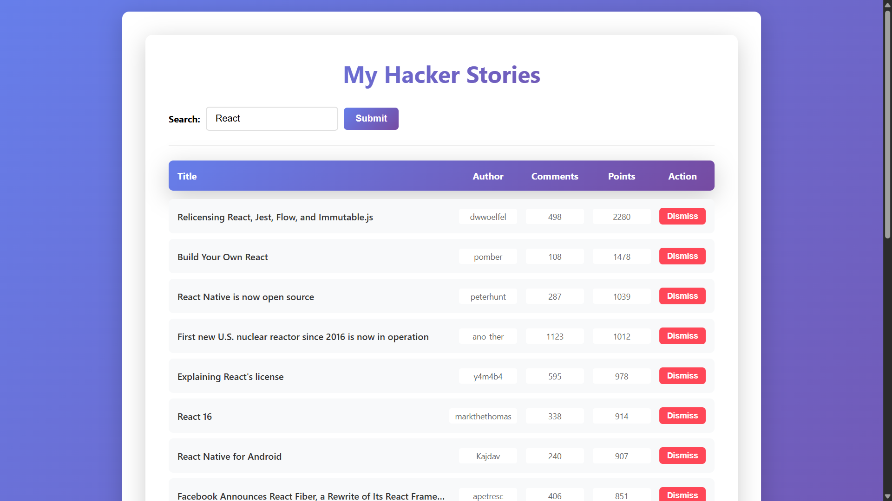
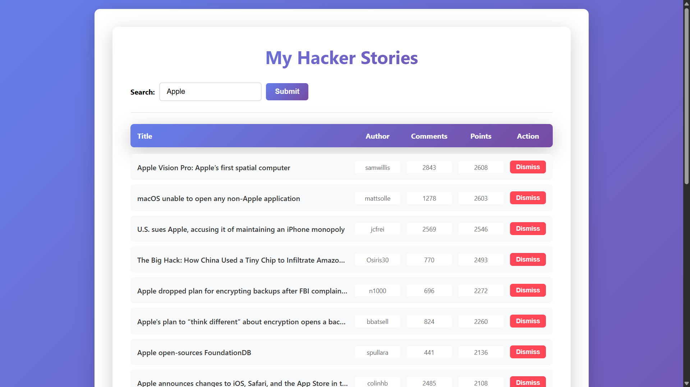

# Hacker Stories

Hacker Stories A React + TypeScript application that fetches and displays trending stories from Hacker News using the HN Algolia API. Built following modern React patterns with hooks, custom state management, and responsive UI design.

## Features:
- Real-time story search with persistent search terms (localStorage)
- Display story title, author, comments, and points
- Dismiss unwanted stories from the list
- Async data fetching with Axios
- Modern purple gradient UI with smooth animations
- Custom hooks for state persistence

**🔵 Note:** This project is based on *Road to React (2025 edition)*. 

**🔵 Note:** I’m following the book step by step, implementing examples in **TypeScript** instead of plain JSX.

## Tech Stack
- React 19
- TypeScript
- Axios for HHTP request
- Vite for building tooling
- Eslint for code quality

## Screenshots

